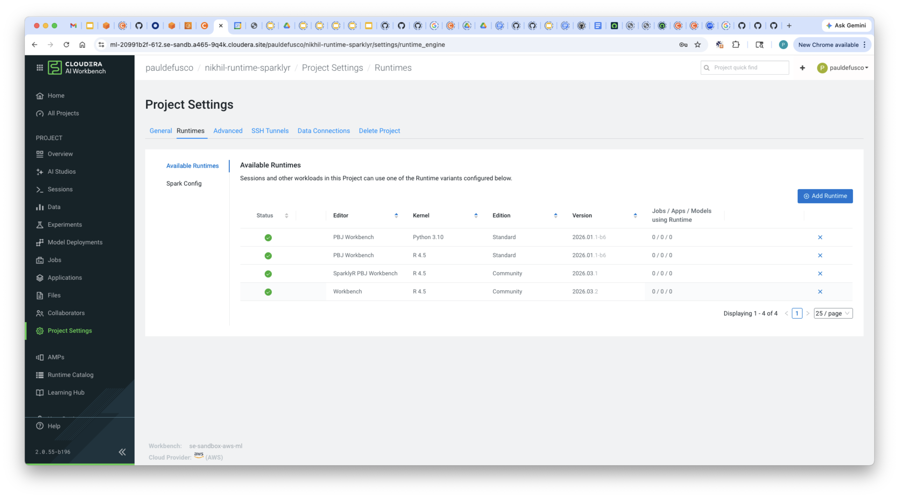

# CAI Custom R Runtime with JFrog

## Objective

This demo shows how to create a custom R runtime extending the Cloudera AI R 4.5 PBJ Runtime, push it to a private Jfrog repository, and then import it into the CAI Runtime Catalog.

## End to End Demo

### 1. Create Dockerfile

In your local environment, create a new Dockerfile (if you cloned this github, an example has already been provided). Familiarize yourself with the code.

```
# Base Cloudera AI Runtime
FROM docker.repository.cloudera.com/cloudera/cdsw/ml-runtime-pbj-workbench-r4.5-standard:2026.01.1-b6

# Switch to root to install R packages if needed
USER root

# Install sparklyr without pulling Spark dependencies
# (sparklyr itself does not install Spark unless explicitly requested via spark_install())
RUN R -e "install.packages('sparklyr', repos='https://cloud.r-project.org', dependencies=TRUE)"

# Override Runtime label and environment variables metadata
ENV ML_RUNTIME_EDITOR="Workbench" \
    ML_RUNTIME_EDITION="Community" \
    ML_RUNTIME_SHORT_VERSION="2026.03" \
    ML_RUNTIME_MAINTENANCE_VERSION="2" \
    ML_RUNTIME_FULL_VERSION="2026.03.2" \
    ML_RUNTIME_DESCRIPTION="Runtime for Nikhil"

LABEL com.cloudera.ml.runtime.editor=$ML_RUNTIME_EDITOR \
      com.cloudera.ml.runtime.edition=$ML_RUNTIME_EDITION \
      com.cloudera.ml.runtime.full-version=$ML_RUNTIME_FULL_VERSION \
      com.cloudera.ml.runtime.short-version=$ML_RUNTIME_SHORT_VERSION \
      com.cloudera.ml.runtime.maintenance-version=$ML_RUNTIME_MAINTENANCE_VERSION \
      com.cloudera.ml.runtime.description=$ML_RUNTIME_DESCRIPTION
```

Notice the base CAI runtime "ml-runtime-pbj-workbench-r4.5-standard:2026.01.1-b6" is extended.

The CAI engineering team periodically tests, maintains and publishes this and other runtimes in [this GitHub repository](https://github.com/cloudera/ml-runtimes).

In this example, the "sparklyr" package is installed in the runtime so users who launch sessions, jobs, and other workloads in CAI don't have to.

You can customize this Dockerfile to include more packages. And, as shown in "sparklyrtest.R", you can still install other packages on top of the ones provided in the runtime. When you do this, package dependencies are saved in the project files so there is no need to reinstall in the future.

Notice Runtime Metadata is mandatory and must uniquely identify each build. For a more detailed explanation of the metadata fields, please visit [this page](https://docs.cloudera.com/machine-learning/cloud/runtimes/topics/ml-metadata-for-custom-runtimes.html) in the documentation.

### 2. Build and Push Image to JFrog

```
docker build -t cai-sparklyr-jfrog:latest .
```

```
docker tag cai-sparklyr-jfrog:latest \
  trialq7b92r.jfrog.io/cldr-demo-docker-local/cai-sparklyr-jfrog:latest
```

```
docker push \
  trialq7b92r.jfrog.io/cldr-demo-docker-local/cai-sparklyr-jfrog:latest
```

Validate build by going to "Artifactory" -> "Artifacts" -> "<name-of-your-repository>"



### 3. Create Docker Credentials in Cloudera AI Workbench

Navigate to "Site Administration" -> "Runtimes" -> "Docker Credentials" and create a new credential and set the following fields:

```
Name: sparklyr-jfrog-credentials
Server: the full image URI as shown when the repository is created e.g. "https://trialq7b92r.jfrog.io/artifactory/cldr-demo-docker-local/cai-sparklyr-jfrog/latest/" - this value is also available in the jfrog UI under Artifacts.
Username: your jfrog username
Password: your jfrog password
```

### 4. Import Runtime in the Catalog and Run Test Session

In the Runtime Catalog, select the "Add Runtime" icon.

Apply the previously configured credentials and input the entire URI path in the "Registry of Docker Image to Upload" field.

The image will now become available in the Runtime Catalog UI

### 5. Run Test Session

Clone this GitHub repository as a new CAI project and add the new runtime.

Create a test session and run the code. Notice the URI is now showing as the Runtime ID in the Session UI.
